# toad-eye 🐸👁️‍🗨️🤖


[](https://www.npmjs.com/package/toad-eye)


**LLM observability in 3 commands. Auto-instrument, trace, alert, save money.**

You don't know what your LLMs cost, how slow they are, or why they fail. toad-eye gives you complete visibility with zero manual instrumentation.


## Quick start

**Prerequisites:** [Docker Desktop](https://docs.docker.com/get-started/get-docker/) (or Docker Engine + Compose plugin)

```bash
npm install toad-eye
npx toad-eye init       # scaffold observability stack
npx toad-eye up         # start Grafana + Prometheus + Jaeger
npx toad-eye demo       # send mock LLM traffic, see data immediately
```

> Dashboards will be empty until data arrives. Run `npx toad-eye demo` to send mock traffic and verify the stack works.

```typescript
import { initObservability } from "toad-eye";

initObservability({
  serviceName: "my-app",
  instrument: ["openai", "anthropic"],
});

// That's it. Every SDK call is auto-traced — including streaming.
```

> ⚠️ By default, toad-eye records prompt and completion text in spans. Set `recordContent: false` for PII-sensitive workloads (healthcare, finance, legal).

Open [localhost:3100](http://localhost:3100) (Grafana, admin/admin) to see your dashboards.

## What you get

| Feature                  | Description                                                                                |
| ------------------------ | ------------------------------------------------------------------------------------------ |
| **Auto-instrumentation** | OpenAI, Anthropic, Gemini, Vercel AI SDK — regular + streaming                             |
| **8 Grafana dashboards** | Overview, Cost, Latency, Errors, Model Comparison, FinOps, Provider Health, Agent Workflow |
| **Cost tracking**        | Per-request USD cost, daily totals, projected monthly spend                                |
| **Budget guards**        | Daily/per-user/per-model spend limits — warn, block, or auto-downgrade                     |
| **Privacy controls**     | Built-in PII redaction (email, SSN, CC, phone), hashing, content masking                   |

<details>
<summary>Advanced features</summary>

| Feature                 | Description                                                                       |
| ----------------------- | --------------------------------------------------------------------------------- |
| **Multi-agent tracing** | ReAct steps, handoffs, loop detection, maxSteps guard                             |
| **Shadow guardrails**   | Record what _would_ be blocked without blocking — tune thresholds on live traffic |
| **Quality proxy**       | Empty response rate, latency per token — zero-dependency quality metrics          |
| **Semantic drift**      | Detect silent quality degradation via embedding comparison                        |
| **Tail sampling**       | Keep 100% errors + slow traces, sample healthy traffic via OTel Collector         |
| **Alerting**            | Cost spikes, latency anomalies, error rate — via Telegram, Slack, email, webhook  |
| **FinOps attribution**  | Break down costs by team, user, feature, environment                              |
| **TTFT metric**         | Time To First Token for streaming — separate from total duration                  |
| **Trace export**        | Convert production Jaeger traces into regression test cases                       |

</details>

## Auto-instrumentation 🤖

Zero-code instrumentation for popular LLM SDKs. No wrappers needed.

```typescript
initObservability({
  serviceName: "my-app",
  instrument: ["openai", "anthropic"],
});
```

**Supported SDKs:** OpenAI (`openai`), Anthropic (`@anthropic-ai/sdk`), Google GenAI (`@google/generative-ai`), Vercel AI SDK (`ai`)

Both regular and **streaming** calls are fully instrumented — spans, metrics, and cost tracking work transparently for `stream: true`.

Vercel AI SDK uses a SpanProcessor (not monkey-patching) — add `instrument: ['ai']` and `experimental_telemetry: withToadEye()` to your calls.

<details>
<summary>Manual instrumentation (custom providers)</summary>

Use `traceLLMCall` when you need to instrument a provider not in the auto-instrument list, or want explicit control over span data:

```typescript
import OpenAI from "openai";
import { initObservability, traceLLMCall } from "toad-eye";

initObservability({ serviceName: "my-app" });

const openai = new OpenAI();

const result = await traceLLMCall(
  { provider: "openai", model: "gpt-4o", prompt: "Hello" },
  async () => {
    const res = await openai.chat.completions.create({
      model: "gpt-4o",
      messages: [{ role: "user", content: "Hello" }],
    });
    return {
      completion: res.choices[0]?.message.content ?? "",
      inputTokens: res.usage?.prompt_tokens ?? 0,
      outputTokens: res.usage?.completion_tokens ?? 0,
      // cost is auto-calculated from model + tokens if omitted
    };
  },
);
```

> Or skip this entirely — use `instrument: ['openai']` for zero-code instrumentation.

</details>

## Budget guards

Prevent cost overruns at runtime. Three modes: warn, block, or auto-downgrade to a cheaper model.

```typescript
initObservability({
  serviceName: "my-app",
  budgets: {
    daily: 50, // $50/day max
    perUser: 5, // $5/day per user
    perModel: { "gpt-4o": 30 }, // $30/day on GPT-4o
  },
  onBudgetExceeded: "block", // throws ToadBudgetExceededError
});
```

| Mode        | Behavior                                            |
| ----------- | --------------------------------------------------- |
| `warn`      | Log warning, continue normally                      |
| `block`     | Throw `ToadBudgetExceededError` before LLM call     |
| `downgrade` | Call `downgradeCallback` to switch to cheaper model |

## Agent observability

Structured tracing for ReAct agents with multi-agent support, handoffs, and loop detection.

```typescript
import { traceAgentQuery } from "toad-eye";

const result = await traceAgentQuery(
  "What's the weather like?",
  async (step) => {
    step({ type: "think", stepNumber: 1, content: "Need weather data" });
    const data = await getWeather();
    step({ type: "answer", stepNumber: 2, content: data.summary });
    return { answer: data.summary };
  },
);
```

<details>
<summary>Full ReAct pattern (think → act → observe → answer)</summary>

```typescript
const result = await traceAgentQuery(
  "Is anything dangerous near Earth?",
  async (step) => {
    step({
      type: "think",
      stepNumber: 1,
      content: "I need to check asteroids",
    });
    const data = await callTool("near-earth-asteroids");
    step({ type: "act", stepNumber: 2, toolName: "near-earth-asteroids" });
    step({
      type: "observe",
      stepNumber: 3,
      content: `${data.length} asteroids found`,
    });
    step({
      type: "answer",
      stepNumber: 4,
      content: "7 asteroids passing safely",
    });
    return { answer: "7 asteroids passing safely" };
  },
);
```

</details>

## FinOps attribution

Track costs by team, user, feature, or any business dimension:

```typescript
initObservability({
  serviceName: "my-app",
  attributes: { team: "checkout", environment: "production" },
});

await traceLLMCall(
  {
    provider: "openai",
    model: "gpt-4o",
    prompt: "Summarize order",
    attributes: { userId: "user-123", feature: "order-summary" },
  },
  () => callLLM(),
);
```

<details>
<summary>More features</summary>

### Shadow guardrails

Record what _would_ have been blocked without blocking. Tune thresholds on live traffic.

```typescript
import { recordGuardResult } from "toad-eye";

recordGuardResult({
  mode: "shadow",
  passed: false,
  ruleName: "pii_filter",
  failureReason: "SSN detected in response",
});
```

### Semantic drift monitoring

Detect silent LLM quality degradation by comparing responses to a saved baseline via embeddings.

```typescript
import { createDriftMonitor } from "toad-eye";

const monitor = createDriftMonitor({
  embedding: { provider: "openai", apiKey: process.env.OPENAI_API_KEY! },
  baselinePath: "./baseline.json",
  sampleRate: 10,
});

monitor.checkInBackground(response, "openai", "gpt-4o");
```

### Privacy controls

| Goal                        | Config                           |
| --------------------------- | -------------------------------- |
| Don't store text at all     | `recordContent: false`           |
| Remove common PII           | `redactDefaults: true`           |
| Remove custom patterns      | `redactPatterns: [/regex/g]`     |
| Store hashes only (no text) | `hashContent: true, salt: "..."` |
| Audit what was masked       | `auditMasking: true`             |

```typescript
initObservability({
  serviceName: "my-app",
  redactDefaults: true, // built-in PII patterns (email, SSN, CC, phone)
  recordContent: false, // disable prompt/completion recording
  hashContent: true, // SHA-256 hash instead of plain text
  salt: "my-secret", // prevent rainbow table attacks
  auditMasking: true, // log what was masked (debug only)
  redactPatterns: [/custom-pattern/g], // additional regex redaction
});
```

### Session tracking

```typescript
initObservability({
  serviceName: "my-app",
  sessionId: "static-session-id",
  sessionExtractor: () => getCurrentSessionId(), // or dynamic
});
```

### Built-in cost tracking

```typescript
import { setCustomPricing } from "toad-eye";

setCustomPricing({
  "my-fine-tuned-model": { inputPer1M: 5, outputPer1M: 15 },
});
```

### Alerting

```yaml
alerts:
  - name: cost_spike
    metric: gen_ai.client.request.cost
    condition: sum_1h > 10
    channels: [slack]

  - name: error_rate
    metric: gen_ai.client.errors
    condition: ratio_15m > 0.05
    channels: [telegram]
```

Channels: Telegram, Slack webhook, HTTP webhook, email (SMTP).

### Trace-to-dataset export

Convert production Jaeger traces into test cases:

```bash
npx toad-eye export-trace <trace_id> --output ./evals/
```

### Cloud mode (coming soon)

No Docker needed. Send telemetry to toad-eye cloud with one line:

```typescript
initObservability({
  serviceName: "my-app",
  apiKey: "toad_xxxxxxxx",
  instrument: ["openai"],
});
```

Self-hosted mode remains the default. Cloud mode activates automatically when `apiKey` is set.

</details>

## Grafana dashboards

8 pre-built dashboards auto-provisioned on `npx toad-eye init`:

| Dashboard              | What it shows                                                    |
| ---------------------- | ---------------------------------------------------------------- |
| **Overview**           | Request rate, error rate, latency p50/p95, cost, totals          |
| **Cost Breakdown**     | Spend by provider/model, daily trend, projected monthly          |
| **Latency Analysis**   | p50/p95/p99 by model, distribution histogram, TTFT               |
| **Error Drill-down**   | Error rate by provider/model, error vs success                   |
| **Model Comparison**   | Latency vs cost vs error rate vs throughput per model            |
| **FinOps Attribution** | Cost by team/user/feature, projected spend, what-if table        |
| **Provider Health**    | Provider status (healthy/degraded/down), uptime, error breakdown |
| **Agent Workflow**     | Steps per query, tool usage frequency, step type breakdown       |

## CLI

| Command                          | Description                                     |
| -------------------------------- | ----------------------------------------------- |
| `npx toad-eye init`              | Scaffold Docker Compose + observability configs |
| `npx toad-eye up`                | Start the stack                                 |
| `npx toad-eye down`              | Stop the stack                                  |
| `npx toad-eye status`            | Show running services and URLs                  |
| `npx toad-eye demo`              | Send mock LLM traffic to see data in Grafana    |
| `npx toad-eye export-trace <id>` | Export a Jaeger trace to toad-eval YAML         |

## Architecture



## What it tracks

<details>
<summary>Metrics & span attributes</summary>

### Metrics (OTel GenAI semconv)

| Metric                                       | Type      | Description                 |
| -------------------------------------------- | --------- | --------------------------- |
| `gen_ai.client.operation.duration`           | Histogram | Request latency (ms)        |
| `gen_ai.client.time_to_first_token`          | Histogram | TTFT for streaming (ms)     |
| `gen_ai.client.request.cost`                 | Histogram | Cost per request (USD)      |
| `gen_ai.client.token.usage`                  | Counter   | Total tokens consumed       |
| `gen_ai.client.requests`                     | Counter   | Total requests              |
| `gen_ai.client.errors`                       | Counter   | Total failed requests       |
| `gen_ai.agent.steps_per_query`               | Histogram | Agent steps per query       |
| `gen_ai.agent.tool_usage`                    | Counter   | Agent tool invocations      |
| `gen_ai.toad_eye.guard.evaluations`          | Counter   | Guard evaluations per rule  |
| `gen_ai.toad_eye.guard.would_block`          | Counter   | Would-have-blocked per rule |
| `gen_ai.toad_eye.semantic_drift`             | Histogram | Drift from baseline (0..1)  |
| `gen_ai.toad_eye.budget.exceeded`            | Counter   | Budget exceeded events      |
| `gen_ai.toad_eye.budget.blocked`             | Counter   | LLM calls blocked by budget |
| `gen_ai.toad_eye.budget.downgraded`          | Counter   | LLM calls downgraded        |
| `gen_ai.toad_eye.response.empty`             | Counter   | Empty/whitespace responses  |
| `gen_ai.toad_eye.response.latency_per_token` | Histogram | Generation speed (ms/token) |

### Span attributes

| Attribute                    | Description                                  |
| ---------------------------- | -------------------------------------------- |
| `gen_ai.provider.name`       | `anthropic`, `gemini`, `openai`              |
| `gen_ai.request.model`       | Model identifier                             |
| `gen_ai.usage.input_tokens`  | Tokens in the prompt                         |
| `gen_ai.usage.output_tokens` | Tokens in the completion                     |
| `gen_ai.request.temperature` | Temperature parameter                        |
| `gen_ai.toad_eye.cost`       | Cost in USD                                  |
| `gen_ai.agent.step.type`     | Agent step: think/act/observe/answer/handoff |
| `gen_ai.agent.tool.name`     | Tool name for agent act steps                |
| `gen_ai.agent.handoff.to`    | Target agent for handoff steps               |
| `gen_ai.agent.loop_count`    | Agent loop iterations (observe→think)        |
| `gen_ai.toad_eye.guard.mode` | Guard mode: shadow/enforce                   |
| `session.id`                 | Session identifier (if configured)           |

</details>

## Services

| Service        | URL                                                     |
| -------------- | ------------------------------------------------------- |
| Grafana        | [localhost:3100](http://localhost:3100) (admin / admin) |
| Jaeger UI      | [localhost:16686](http://localhost:16686)               |
| Prometheus     | [localhost:9090](http://localhost:9090)                 |
| OTel Collector | [localhost:4318](http://localhost:4318)                 |

## Tech stack

- TypeScript, OpenTelemetry SDK 2.x, OTel GenAI semantic conventions
- Hono (demo server + cloud ingestion server)
- Docker Compose (Prometheus, Jaeger, Grafana, OTel Collector)
- Vitest (143+ tests)
