# toad-eye 🐸👁️

**Observability for MCP servers and LLM applications.**

One line of code. Full traces, metrics, and Grafana dashboards.
Self-hosted. Privacy-first. No vendor lock-in.

[](https://www.npmjs.com/package/toad-eye)


---

## Quick Start — MCP Server

Add observability to any MCP server in 2 lines:

```typescript
import { McpServer } from "@modelcontextprotocol/sdk/server/mcp.js";
import { initObservability } from "toad-eye";
import { toadEyeMiddleware } from "toad-eye/mcp";

initObservability({ serviceName: "my-mcp-server" });

const server = new McpServer({ name: "my-server", version: "1.0.0" });
toadEyeMiddleware(server);

// Every tool call, resource read, and prompt is now traced.
// Spans appear in Jaeger. Metrics flow to Prometheus. Dashboards ready in Grafana.
```

Privacy by default — tool arguments and results are NOT recorded unless you opt in:

```typescript
toadEyeMiddleware(server, {
  recordInputs: true,
  redactKeys: ["apiKey", "token"],
});
```

Safe for stdio transport — OTel diagnostics are redirected to stderr.

## Quick Start — LLM Calls

Auto-instrument OpenAI, Anthropic, Gemini, and Vercel AI SDK — zero wrappers:

```typescript
import { initObservability } from "toad-eye";

initObservability({
  serviceName: "my-app",
  instrument: ["openai", "anthropic"],
});

// Every SDK call is auto-traced — including streaming.
```

## Set Up the Stack

```bash
npm install toad-eye
npx toad-eye init       # scaffold observability configs
npx toad-eye up         # start Grafana + Prometheus + Jaeger + OTel Collector
npx toad-eye demo       # send mock traffic — see data in Grafana immediately
```

Open [localhost:3100](http://localhost:3100) (Grafana, admin/admin). 11 dashboards are pre-built and ready.

> **Requires:** [Docker Desktop](https://docs.docker.com/get-started/get-docker/) (or Docker Engine + Compose plugin)

<!-- TODO: add Grafana dashboard screenshot here -->

## What You Get

**Instrumentation:** auto-instrument OpenAI, Anthropic, Gemini, Vercel AI SDK, and MCP servers — regular and streaming calls, with full cost tracking.

**11 Grafana dashboards:** Overview, Cost Breakdown, Latency Analysis, Errors, Model Comparison, FinOps Attribution, Provider Health, Agent Workflow, MCP Server, MCP End-to-End, MCP Tool Analytics.

**Budget guards:** daily, per-user, per-model spend limits. Three modes — warn, block, or auto-downgrade to a cheaper model.

**Agent tracing:** structured ReAct tracing with multi-agent support, handoffs, and loop detection. Follows OTel GenAI semantic conventions.

**Privacy controls:** `recordContent: false` to disable prompt/completion recording, built-in PII redaction (email, SSN, CC, phone), SHA-256 hashing, key redaction.

**Alerting:** cost spikes, latency anomalies, error rate alerts via Telegram, Slack, email, or webhook.

**Semantic drift detection:** catch silent LLM quality degradation by comparing responses to a saved baseline via embeddings.

**Trace export:** convert production Jaeger traces into regression test cases for [toad-eval](https://github.com/vola-trebla/toad-eval).

## Budget Guards

```typescript
initObservability({
  serviceName: "my-app",
  budgets: {
    daily: 50, // $50/day max
    perUser: 5, // $5/day per user
    perModel: { "gpt-4o": 30 }, // $30/day on GPT-4o
  },
  onBudgetExceeded: "block", // or "warn" or "downgrade"
});
```

## Agent Observability

```typescript
import { traceAgentQuery } from "toad-eye";

const result = await traceAgentQuery(
  { query: "What's the weather?", agentName: "weather-bot" },
  async (step) => {
    step({ type: "think", stepNumber: 1, content: "Need weather data" });
    const data = await getWeather();
    step({ type: "act", stepNumber: 2, toolName: "get_weather" });
    step({ type: "answer", stepNumber: 3, content: data.summary });
    return { answer: data.summary };
  },
);
// Produces: invoke_agent weather-bot → execute_tool get_weather
```

## CLI

```
npx toad-eye init [--force]     Scaffold Docker Compose + observability configs
npx toad-eye up                 Start the stack
npx toad-eye down               Stop the stack
npx toad-eye status             Show running services and URLs
npx toad-eye demo               Send mock LLM traffic to Grafana
npx toad-eye export-trace <id>  Export a Jaeger trace to toad-eval YAML
```

## Architecture



## Imports

```typescript
import { initObservability, traceLLMCall } from "toad-eye"; // core
import { toadEyeMiddleware } from "toad-eye/mcp"; // MCP server middleware
import { AlertManager } from "toad-eye/alerts"; // alerting engine
import { createDriftMonitor } from "toad-eye/drift"; // semantic drift
import { exportTrace } from "toad-eye/export"; // trace → YAML
import { ToadEyeAISpanProcessor, withToadEye } from "toad-eye/vercel"; // Vercel AI SDK
```

## Services

After `npx toad-eye up`:

```
Grafana         http://localhost:3100   (admin / admin)
Jaeger UI       http://localhost:16686
Prometheus      http://localhost:9090
OTel Collector  http://localhost:4318
```

## OTel Compatibility

toad-eye follows [OTel GenAI semantic conventions](https://opentelemetry.io/docs/specs/semconv/gen-ai/). Traces work natively with Jaeger, Datadog, Grafana Tempo, Honeycomb, SigNoz, Arize Phoenix, and any OTel-compatible backend.

Full metrics and span attribute reference: [COMPATIBILITY.md](packages/instrumentation/COMPATIBILITY.md)

## Tech Stack

TypeScript · OpenTelemetry SDK 2.x · Hono · Docker Compose (Prometheus, Jaeger, Grafana, OTel Collector) · Vitest (278+ tests)
