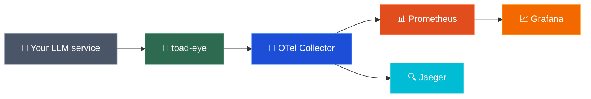
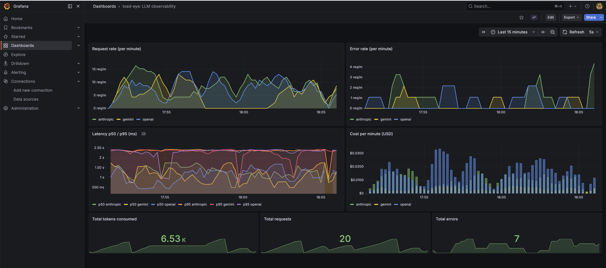
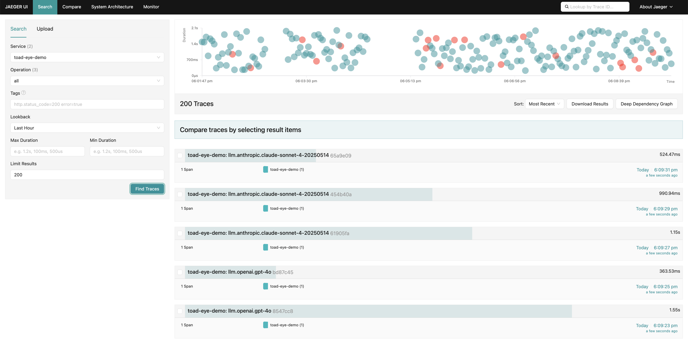

# toad-eye 🐸👁️


OpenTelemetry-based observability toolkit for LLM systems.

One-line instrumentation for any LLM service — get traces, metrics, and Grafana dashboards out of the box.

## Why toad-eye?

LLM APIs are black boxes — you don't know what they cost, how slow they are, or why they fail. toad-eye gives you full visibility with one line of code.

## Architecture



## Quick start

```bash
npm install
cd infra && docker compose up -d   # start observability stack
npm run demo                        # start mock LLM service
npm run load --workspace=demo       # send test traffic
```

| Service        | URL                                       |
| -------------- | ----------------------------------------- |
| Grafana        | [localhost:3000](http://localhost:3000)   |
| Jaeger UI      | [localhost:16686](http://localhost:16686) |
| Prometheus     | [localhost:9090](http://localhost:9090)   |
| OTel Collector | [localhost:4318](http://localhost:4318)   |

## Usage

```typescript
import { initObservability, traceLLMCall } from "toad-eye";

// one-line init
initObservability({
  serviceName: "my-llm-service",
  endpoint: "http://localhost:4318",
});

// wrap any LLM call
const result = await traceLLMCall(
  { provider: "anthropic", model: "claude-sonnet-4-20250514", prompt: "hello" },
  () => callYourLLM(),
);
```

> **Privacy mode:** pass `recordContent: false` to `initObservability()` to stop recording prompt/completion text in spans. Useful in production when prompts contain sensitive data.

## What it tracks

### Metrics

| Metric                 | Type      | Description                            |
| ---------------------- | --------- | -------------------------------------- |
| `llm.request.duration` | Histogram | Request latency in milliseconds        |
| `llm.request.cost`     | Histogram | Cost per request in USD                |
| `llm.tokens`           | Counter   | Total tokens consumed (input + output) |
| `llm.requests`         | Counter   | Total requests made                    |
| `llm.errors`           | Counter   | Total failed requests                  |

All metrics are labeled with `provider` and `model` for filtering and grouping.

### Span attributes

| Attribute           | Type   | Description                     |
| ------------------- | ------ | ------------------------------- |
| `llm.provider`      | string | `anthropic`, `gemini`, `openai` |
| `llm.model`         | string | Model identifier                |
| `llm.prompt`        | string | Prompt sent to the LLM          |
| `llm.completion`    | string | Response from the LLM           |
| `llm.input_tokens`  | number | Tokens in the prompt            |
| `llm.output_tokens` | number | Tokens in the completion        |
| `llm.cost`          | number | Cost in USD                     |
| `llm.temperature`   | number | Temperature parameter           |
| `llm.status`        | string | `success` or `error`            |
| `llm.error`         | string | Error message (if failed)       |

## Grafana dashboard



## Jaeger traces



## Project structure

```
packages/instrumentation/   — NPM package (toad-eye)
demo/                       — mock LLM service for testing
infra/                      — docker-compose stack (OTel + Prometheus + Jaeger + Grafana)
```

## Tech stack

- TypeScript, OpenTelemetry SDK 2.x, OTLP exporters
- Hono (demo server)
- Docker Compose (Prometheus, Jaeger, Grafana, OTel Collector)
