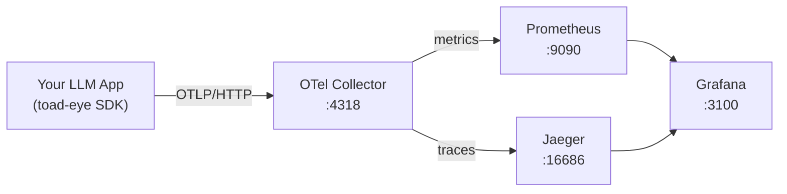

# toad-eye 🐸👁️

[](https://www.npmjs.com/package/toad-eye)
[](https://www.npmjs.com/package/toad-eye)
[](https://github.com/vola-trebla/toad-eye/actions)
[](https://opensource.org/licenses/ISC)

**Full observability for LLM services — traces, metrics, and Grafana dashboards in one line of code.**

> LLM APIs are black boxes. You don't know what they cost, how slow they are, or why they fail.
> toad-eye gives you complete visibility with zero manual instrumentation.

<!-- TODO: record GIF — terminal: npx toad-eye init → up → demo → Grafana with live data -->
<!--  -->

---

## Quick Start

```bash
npm install toad-eye
npx toad-eye init   # scaffold observability stack configs
npx toad-eye up     # start OTel Collector + Prometheus + Jaeger + Grafana
```

```typescript
import { initObservability } from "toad-eye";

initObservability({
  serviceName: "my-app",
  instrument: ["anthropic", "openai"],
});
// Every LLM call is now automatically traced. Open http://localhost:3100
```

That's it. **No wrappers. No manual spans.** All your Anthropic and OpenAI calls are traced automatically.

---

## What you get


| Feature                  | Details                                                                           |
| ------------------------ | --------------------------------------------------------------------------------- |
| **Auto-instrumentation** | Patches Anthropic, OpenAI, Gemini SDKs — no code changes needed                   |
| **5 Grafana dashboards** | Overview · Cost Breakdown · Latency Analysis · Model Comparison · Error Drilldown |
| **Cost tracking**        | Per-request USD cost, hourly/daily totals, top models by spend                    |
| **Cost alerts**          | Threshold alerts via Telegram, Slack, email, or webhook                           |
| **Distributed traces**   | Full spans in Jaeger with prompts, completions, tokens                            |
| **One-command stack**    | `npx toad-eye up` starts the entire observability stack                           |

---

## Observability stack



| Service    | URL                                   |
| ---------- | ------------------------------------- |
| Grafana    | http://localhost:3100 (admin / admin) |
| Jaeger     | http://localhost:16686                |
| Prometheus | http://localhost:9090                 |

---

## Metrics

| Metric                 | Type      | Description                                 |
| ---------------------- | --------- | ------------------------------------------- |
| `llm.request.duration` | Histogram | Request latency (ms), by provider + model   |
| `llm.request.cost`     | Histogram | Cost per request (USD), by provider + model |
| `llm.tokens`           | Counter   | Total tokens consumed (input + output)      |
| `llm.requests`         | Counter   | Total requests made                         |
| `llm.errors`           | Counter   | Total failed requests                       |

---

## Advanced

### Manual tracing

If you need to trace a provider not yet auto-instrumented:

```typescript
import { traceLLMCall } from "toad-eye";

const result = await traceLLMCall(
  { provider: "anthropic", model: "claude-sonnet-4-20250514", prompt: input, temperature: 0.7 },
  () => client.messages.create({ ... }),
  (res) => ({
    completion: res.content[0].text,
    inputTokens: res.usage.input_tokens,
    outputTokens: res.usage.output_tokens,
    cost: calcCost(res.usage),
  }),
);
```

### Privacy mode

Stop recording prompt/completion content in spans — useful in production:

```typescript
initObservability({ serviceName: "my-app", recordContent: false });
```

### Cost alerts

Fire alerts when spend crosses a threshold:

```typescript
import { AlertManager } from "toad-eye";

const alerts = new AlertManager({
  prometheusUrl: "http://localhost:9090",
  channels: {
    telegram: {
      type: "telegram",
      token: process.env.TG_TOKEN!,
      chatId: process.env.TG_CHAT!,
    },
  },
  alerts: [
    {
      name: "cost_spike",
      metric: "llm.request.cost",
      condition: "sum_1h > 10",
      channels: ["telegram"],
    },
  ],
});

alerts.start();
```

Or configure via YAML — see [`infra/toad-eye/alerts.yml`](https://github.com/vola-trebla/toad-eye/blob/main/infra/toad-eye/alerts.yml).

### Custom OTLP endpoint

```typescript
initObservability({
  serviceName: "my-app",
  endpoint: "http://your-collector:4318",
});
```

---

## CLI reference

```bash
npx toad-eye init     # scaffold infra/toad-eye/ configs into your project
npx toad-eye up       # docker compose up -d (OTel + Prometheus + Jaeger + Grafana)
npx toad-eye down     # docker compose down
npx toad-eye status   # show running services
npx toad-eye demo     # start built-in demo with mock LLM traffic
```
